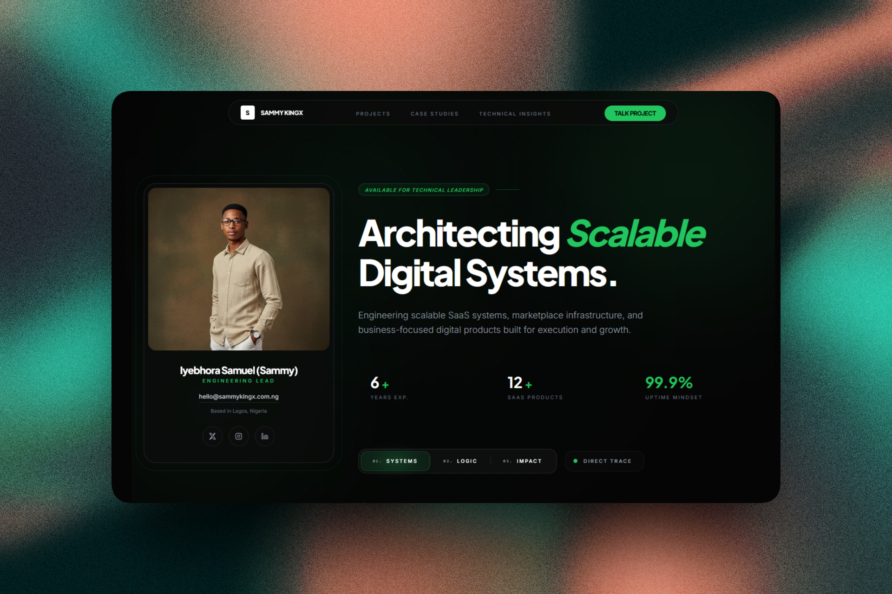

# Sammy Kingx Portfolio



## 🌟 Overview

Welcome to the personal portfolio website of **Sammy Kingx**, a skilled developer and technology enthusiast. This repository houses a modern, responsive portfolio built with cutting-edge web technologies, showcasing projects, skills, and professional insights.

This is a static front-end project that serves as a digital showcase for Sammy's work in software development, featuring an elegant glassmorphism design, smooth animations, and an intuitive user experience.

## ✨ Features

- **Responsive Design**: Optimized for all devices with a mobile-first approach
- **Glassmorphism UI**: Modern aesthetic with translucent elements and subtle shadows
- **Interactive Animations**: Powered by GSAP and AOS for engaging user interactions
- **Project Showcases**: Detailed case studies for featured projects like ScholarlyMe and Servio
- **Contact Integration**: Seamless ways to connect and collaborate
- **Accessibility Focused**: Built with semantic HTML and keyboard navigation support
- **Performance Optimized**: Fast loading with efficient asset management

## 🛠️ Tech Stack

- **Frontend Framework**: HTML5, Tailwind CSS v4
- **JavaScript**: ES6+ modules for component architecture
- **Animation Libraries**:
  - GSAP (GreenSock Animation Platform) for complex animations
  - AOS (Animate On Scroll) for scroll-triggered effects
- **Build Tools**: Custom Tailwind build pipeline with npm scripts
- **Deployment**: Static hosting ready (Netlify, Vercel, or similar)

## 📸 Screenshots

### Design Philosophy


### Impact Visualization


## 🚀 Development

### Prerequisites
- Node.js (v16 or higher)
- npm or yarn

### Installation

1. Clone the repository:
```bash
git clone https://github.com/sammykingx/portfolio.git
cd portfolio
```

2. Install dependencies:
```bash
npm install
```

### Development Commands

- **Build CSS**: Compile Tailwind styles
```bash
npm run build:css
```

- **Development Mode**: Watch for changes and rebuild automatically
```bash
npm run dev
```

- **Full Build**: Build for production
```bash
npm run build
```

## 📁 Project Structure

```
portfolio/
├── index.html                 # Main landing page
├── package.json              # Dependencies and scripts
├── README.md                 # This file
├── articles/                 # Blog/article pages
├── case-studies/            # Detailed project case studies
│   ├── scholarlyme/         # ScholarlyMe project details
│   └── servio/              # Servio project details
├── projects/                 # Project overview pages
├── src/
│   ├── css/
│   │   ├── input.css        # Tailwind entry point
│   │   └── styles.css       # Compiled styles
│   ├── images/
│   │   ├── mockups/         # Design mockups and banners
│   │   ├── personal/        # Personal/professional images
│   │   ├── projects/        # Project screenshots
│   │   └── partners/        # Partner/client logos
│   └── js/
│       ├── main.js          # Application entry point
│       ├── app.js           # Core app logic
│       ├── pageAnimations.js # Page-specific animations
│       ├── components/      # Reusable UI components
│       │   ├── baseComponents.js
│       │   ├── homePage/    # Home page components
│       │   ├── projects/    # Project-related components
│       │   └── shared/      # Shared components (header, footer)
│       └── utils/           # Utility functions
│           ├── gsapAnimation.js
│           └── navigation.js

```

## 🎯 Key Components

- **Hero Section**: Animated introduction with call-to-action
- **Services**: Overview of technical expertise and offerings
- **Projects**: Interactive project cards with filtering
- **Case Studies**: In-depth project documentation
- **Contact**: Multiple ways to get in touch
- **Navigation**: Smooth scrolling and mobile-responsive menu

## 🤝 Contributing

While this is a personal portfolio, contributions for improvements are welcome! Please:

1. Fork the repository
2. Create a feature branch
3. Make your changes
4. Submit a pull request

## 📄 License

This project is private and proprietary. All rights reserved.

## 📞 Contact

- **Website**: [sammykingx.com.ng](https://sammykingx.com.ng)
- **Email**: [hello@sammykingx.com.ng]
- **LinkedIn**: [https://www.linkedin.com/in/iyebhora-samuel/]

---

*Built with ❤️ by Sammy Kingx*
- `src/js/utils/gsap-animation.js` — GSAP animation orchestration
- `src/images/` — visual assets used on the page

## Build notes

- The site is static and can be deployed to any static hosting provider.
- `src/css/styles.css` is generated by Tailwind, so update `src/css/input.css` and then rebuild.
- `index.html` references `src/css/styles.css` and the front-end JS modules directly.

## Running locally

This project does not include a built-in HTTP server script, so use a simple static server for local testing if needed.

Example using Python:

```bash
python -m http.server 8000
```

Then visit `http://localhost:8000`.

## Notes

- The JavaScript modules initialize the mobile navigation menu and ambient UI motion.
- AOS and GSAP work together to provide scroll reveal and background animation effects.
- The current build config is optimized for Tailwind CSS production output.
